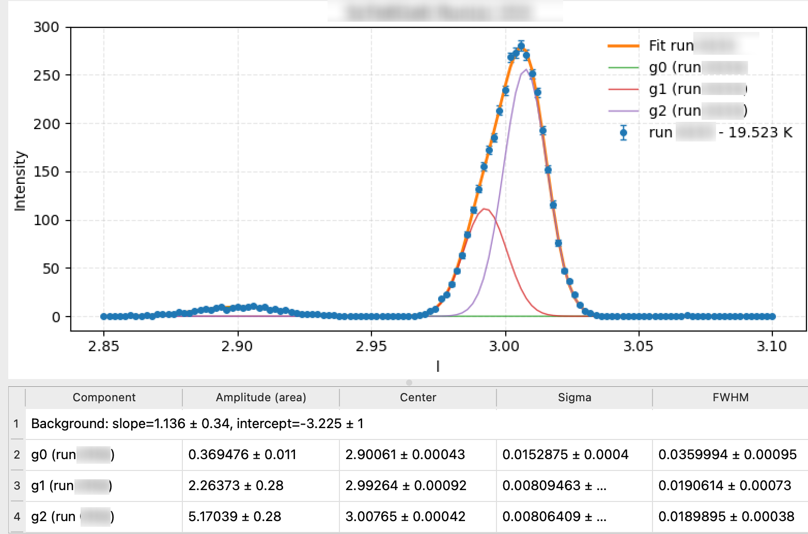

# TriX GUI Tools

Python GUIs for triple-axis neutron spectroscopy data loading, visualization, and peak fitting (to be added).

## New (v0.2.1)
- Allow to change the pannel height ratios between setting, plotting, and fit reports.

## New (v0.2.0)
- Added **Fit Peaks…** dialog: choose run, number of Gaussians, auto-guess, manual centers.
- Gaussian(s) + linear background fit using **lmfit** with **yerr** as weights.
- Results table shows amplitude, center, sigma, **FWHM**, and background.
## Example Fits
<p float="left">
  
  
</p>


## Features
- **`trix_gui.py`** – Load and overplot one or more runs; custom per-run colors; interactive pan/zoom toolbar; save figure.

<p float="left">
  
</p>

- **`load_triX.py`** – Your data loader exposing class `import_triX_single` used by gui.
---

## Requirements
Install Python 3.9+ and then the packages listed in `requirements.txt`:

```bash
pip install -r requirements.txt
```

---

## Expected data layout

This GUI expects your data directory to contain experiment folders in this form (matching your loader):

```
<chosen folder>/
  expXXXX/
    Datafiles/
      {instrument}_expXXXX_scanYYYY.dat
```

Where `instrument` and the temperature column label are provided in the UI.

---

## Quick start

1. Place all files in one folder:
   - `load_triX_murr.py`
   - `trix_gui.py`
   - `requirements.txt`
2. Create & activate a virtual environment (recommended), then:
   ```bash
   pip install -r requirements.txt
   ```
3. Launch the GUIs:
   ```bash
   python trix_gui.py
   python fit_gaussian_peaks.py
   ```
Or
run trix_gui.py in PyCharm (VS code)
---

## Usage

### `trix_gui.py`

- Choose **Data folder** (the parent of `expXXXX/`).
- Enter **Instrument**, **Experiment #**, and **Run numbers** (e.g. `101,103-105`).
- Enter **Temp label** Ask local contact for the sensor name (must match the column header in your files).
- Optional: override X name, toggle normalization to counts/sec, choose per‑run colors.
- Click **Load & Overplot**. Use the toolbar to pan/zoom; **Save Figure…** to export PNG/PDF.

[//]: # ()
[//]: # (### `fit_gaussian_peaks.py`)

[//]: # ()
[//]: # (- Load a single run via the same fields.)

[//]: # (- Choose **# Peaks** and whether to **Auto‑guess** initial centers.)

[//]: # (- Click **Fit** to run `lmfit` with weights `1 / yerr`.)

[//]: # (- The table lists amplitude &#40;area&#41;, center, σ and FWHM with 1σ uncertainties. The plot shows data, total fit, and per‑component curves.)

---
